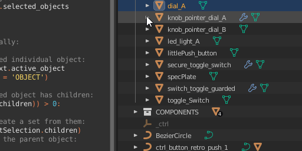

# bl3d-meshShape-renamer
A python script for Blender that will rename child mesh shapes to match their transform-node parents. 

DISCLAIMER: I don't claim to have any deep expertise or understanding of programming or code. I'm just experimenting, learning and sharing what works so that I might help and learn from others.

This script was written and used in Blender 3.3. It was intended to ensure that the child mesh shape name matches its parent transform node.
